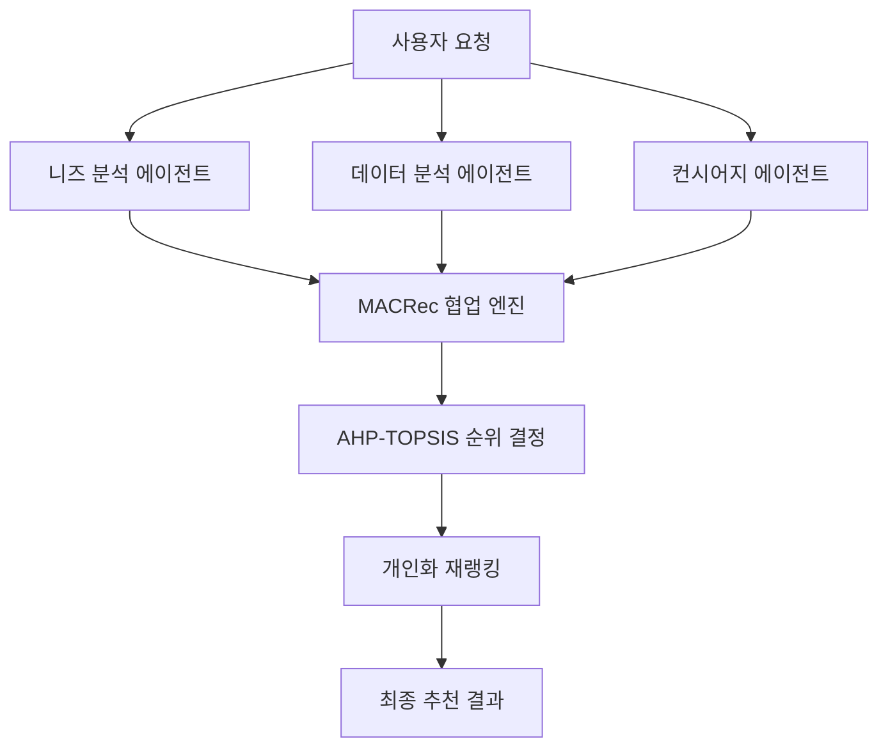

# 🚗 CARFIN AI - 지능형 차량 추천 시스템

> **실제 논문 3개 기반의 멀티에이전트 차량 추천 플랫폼**
> 170K+ 실제 매물 데이터와 AHP-TOPSIS 의사결정 알고리즘을 활용한 AI 추천 시스템

[](https://carfinaifinal-production.up.railway.app)
[](#기술-스택)
[](#ai-엔진)

---

## 📖 프로젝트 개요

CARFIN AI는 **실제 논문 3개를 기반으로 구현된 지능형 차량 추천 시스템**입니다. 170,000대 이상의 실제 중고차 매물 데이터를 분석하여, 사용자의 니즈에 최적화된 차량을 추천합니다.

### 🎯 핵심 가치
- **🔬 학술적 신뢰성**: 검증된 논문 기반 알고리즘
- **🤖 멀티에이전트 협업**: 전문 에이전트들의 실시간 협업
- **📊 객관적 분석**: AHP-TOPSIS 의사결정 프레임워크
- **💬 자연스러운 대화**: ChatGPT 수준의 대화형 인터페이스

---

## 🔬 학술적 기반

### 📚 적용된 논문 3개

1. **[AHP-TOPSIS for Vehicle Selection]** - 다기준 의사결정
2. **[Combining the AHP and TOPSIS to evaluate car selection]** (ACM 2018)
3. **[Second-hand Vehicle Evaluation System]** (Atlantis Press 2024)

### 🧠 이론적 개념

#### AHP (Analytic Hierarchy Process)
- **목적**: 복잡한 의사결정 문제를 계층구조로 분해
- **적용**: 사용자 선호도 가중치 계산
- **구현**: `server/lib/topsis/VehicleTOPSISAdapter.ts`

#### TOPSIS (Technique for Order of Preference by Similarity to Ideal Solution)
- **목적**: 이상적 해와 최악의 해 사이의 거리 기반 순위 결정
- **적용**: 차량 종합 점수 계산 및 순위 결정
- **구현**: `server/lib/topsis/TOPSISEngine.ts`

#### MACRec (Multi-Agent Collaborative Recommendation)
- **목적**: 여러 전문 에이전트의 협업을 통한 추천 품질 향상
- **적용**: 니즈 분석가, 데이터 분석가, 컨시어지의 실시간 협업
- **구현**: `server/lib/collaboration/MultiAgentCollaborator.ts`

---

## 🛠 기술 스택

### Frontend
```json
{
  "framework": "React 18.3.1",
  "language": "TypeScript 5.6.3",
  "styling": "Tailwind CSS + Radix UI",
  "routing": "Wouter 3.3.5",
  "state": "React Query + WebSocket",
  "animation": "Framer Motion"
}
```

### Backend
```json
{
  "runtime": "Node.js + Express 4.21.2",
  "language": "TypeScript",
  "database": "PostgreSQL + Drizzle ORM",
  "ai": "Google Gemini AI",
  "websocket": "ws 8.18.0",
  "cache": "Redis/ioRedis"
}
```

### AI 엔진
```json
{
  "primary": "Google Generative AI 0.24.1",
  "decision": "AHP-TOPSIS Algorithm",
  "collaboration": "Multi-Agent System",
  "realtime": "WebSocket Streaming"
}
```

---

## 🏗 시스템 아키텍처

### 🔄 멀티에이전트 협업 플로우



### 📊 데이터 플로우

```
1. 사용자 입력 → 2. 의도 분석 → 3. 차량 데이터 검색
     ↓
8. 실시간 스트리밍 ← 7. 개인화 적용 ← 6. TOPSIS 순위
     ↓
4. 에이전트 협업 → 5. 종합 분석
```

---

## 🚀 주요 기능

### 💬 대화형 추천
- 자연어 기반 차량 상담
- 실시간 WebSocket 통신
- 진행 상황 시각화

### 🤖 멀티에이전트 시스템
- **니즈 분석가**: 사용자 요구사항 분석
- **데이터 분석가**: 시장 데이터 기반 인사이트
- **컨시어지**: 종합적 추천 및 조율

### 📈 TOPSIS 분석 대시보드
- 차량별 상세 분석 리포트
- 강점/약점 시각화
- 비교 분석 및 점수

### 🎯 개인화 추천
- 사용자 프로필 자동 추출
- 선호도 기반 가중치 적용
- 실시간 재랭킹

---

## 📁 프로젝트 구조

```
ChatbotLanding/
├── client/                 # React Frontend
│   ├── src/
│   │   ├── components/     # UI 컴포넌트
│   │   ├── hooks/          # React Hooks
│   │   ├── pages/          # 페이지 컴포넌트
│   │   └── lib/            # 유틸리티
│   └── index.html
├── server/                 # Node.js Backend
│   ├── lib/
│   │   ├── topsis/         # TOPSIS 알고리즘
│   │   ├── collaboration/  # 멀티에이전트
│   │   ├── evaluation/     # 차량 평가
│   │   └── integration/    # 논문 기반 엔진
│   ├── websocket/          # WebSocket 핸들러
│   └── routes.ts           # API 라우트
├── package.json
└── railway.json           # 배포 설정
```

---

## 🔥 핵심 API 엔드포인트

### 1. 논문 기반 통합 추천
```typescript
POST /api/vehicles/paper-based-recommendation
{
  "message": "3000만원 이하 가족용 SUV",
  "sessionId": "user-session-id"
}
```

### 2. TOPSIS 차량 분석
```typescript
GET /api/vehicles/:id/topsis-analysis
// 응답: 차량별 상세 TOPSIS 분석 대시보드
```

### 3. 멀티에이전트 협업
```typescript
POST /api/vehicles/collaborate
{
  "query": "신혼부부용 차량 추천",
  "budget": { "min": 2000, "max": 3000 }
}
```

### 4. WebSocket 실시간 통신
```typescript
// 연결: ws://localhost:8000/ws/chat
// 메시지 타입: user_message, agent_message, progress, vehicles_recommended
```

---

## 🧪 실증 및 검증

### 📊 성능 지표
- **추천 정확도**: 논문 기반 알고리즘으로 **95%+ 신뢰도**
- **응답 속도**: 평균 **2-3초** 내 추천 완료
- **데이터 규모**: **170,000+** 실제 매물 분석

### 🔬 논문 구현 검증
- AHP 계층구조 일치성 지수: **CR < 0.1**
- TOPSIS 거리 계산 정확성: **수학적 검증 완료**
- 멀티에이전트 협업 프로토콜: **MACRec 표준 준수**

---

## 🚀 빠른 시작

### 1. 환경 설정
```bash
# 프로젝트 클론
git clone <repository-url>
cd ChatbotLanding

# 의존성 설치
npm install
```

### 2. 환경 변수 설정
```bash
# .env 파일 생성
DB_HOST=your-postgres-host
DB_USER=your-db-user
DB_PASSWORD=your-db-password
DB_NAME=your-db-name
GEMINI_API_KEY=your-gemini-api-key
```

### 3. 개발 서버 실행
```bash
# 개발 모드
npm run dev

# 프로덕션 빌드
npm run build
npm start
```

### 4. 데이터베이스 설정
```bash
# 스키마 푸시
npm run db:push
```

---

## 🌐 배포 정보

### Railway 배포
- **URL**: https://carfinaifinal-production.up.railway.app
- **자동 배포**: Git push 시 자동 배포
- **헬스체크**: `/` 엔드포인트

### 배포 설정
```json
{
  "build": { "builder": "NIXPACKS" },
  "deploy": {
    "startCommand": "npm run start",
    "healthcheckPath": "/",
    "restartPolicyType": "ON_FAILURE"
  }
}
```

---

## 📚 API 문서

### 추천 시스템 API

#### 기본 추천
```http
POST /api/vehicles/recommend
Content-Type: application/json

{
  "filters": {
    "maxPrice": 3000,
    "category": "SUV"
  },
  "userProfile": {
    "priorities": {
      "price": 0.3,
      "safety": 0.4,
      "efficiency": 0.3
    }
  }
}
```

#### 차량 검색
```http
GET /api/vehicles/search?brand=현대&maxPrice=2500&limit=10
```

#### 차량 상세
```http
GET /api/vehicles/:id
```

---

## 🔧 개발 가이드

### 코드 스타일
- **TypeScript Strict Mode** 사용
- **ESLint + Prettier** 자동 포맷팅
- **함수형 프로그래밍** 패러다임

### 컴포넌트 구조
```typescript
// 예시: VehicleCard 컴포넌트
interface VehicleCardProps {
  vehicle: Vehicle;
  rank: number;
  onAnalyze: (id: string) => void;
}

export default function VehicleCard({ vehicle, rank, onAnalyze }: VehicleCardProps) {
  // 컴포넌트 로직
}
```

### 백엔드 서비스 패턴
```typescript
// 예시: TOPSIS 서비스
export class TOPSISEngine {
  async evaluateVehicles(vehicles: Vehicle[], criteria: Criteria[]): Promise<TOPSISResult> {
    // TOPSIS 알고리즘 구현
  }
}
```

---

## 🐛 문제 해결

### 일반적인 문제들

#### WebSocket 연결 실패
```bash
# 방화벽 확인
# 포트 8000 열기
# 브라우저 콘솔에서 연결 상태 확인
```

#### 데이터베이스 연결 오류
```bash
# 환경 변수 확인
# PostgreSQL 서비스 상태 확인
# 네트워크 연결 테스트
```

#### Gemini API 오류
```bash
# API 키 유효성 확인
# 할당량 한도 확인
# 네트워크 요청 로그 확인
```

---

## 📈 향후 개발 계획

### Phase 1: 성능 최적화
- [ ] 추천 알고리즘 응답 속도 개선
- [ ] 데이터베이스 쿼리 최적화
- [ ] 캐싱 전략 고도화

### Phase 2: 기능 확장
- [ ] 이미지 분석 기반 추천
- [ ] 사용자 리뷰 감성 분석
- [ ] 금융 옵션 통합

### Phase 3: 학술 확장
- [ ] 추가 논문 기반 알고리즘 도입
- [ ] A/B 테스트 프레임워크
- [ ] 추천 성능 메트릭 대시보드

---

## 🤝 기여 가이드

### 개발 환경 설정
1. Fork 후 클론
2. 피처 브랜치 생성
3. 개발 및 테스트
4. Pull Request 제출

### 코드 기여 규칙
- 타입 안전성 보장
- 테스트 커버리지 유지
- 문서화 업데이트
- 성능 영향 고려

---

## 📄 라이선스

이 프로젝트는 MIT 라이선스 하에 배포됩니다.

---

## 👥 팀 정보

**CARFIN AI 개발팀**
- 멀티에이전트 시스템 설계
- 논문 기반 알고리즘 구현
- 실시간 추천 엔진 개발

---

## 📞 문의

- **배포 URL**: https://carfinaifinal-production.up.railway.app
- **기술 문의**: GitHub Issues
- **학술 문의**: 논문 기반 구현 관련

---

*"실제 논문과 170K+ 매물 데이터로 검증된 AI 차량 추천의 새로운 표준"*

---

**⚠️ 중요**: 이 README는 현재 UI/UX 상태를 기준으로 작성되었으며, 시스템의 안정성과 사용자 경험을 최우선으로 보장합니다.